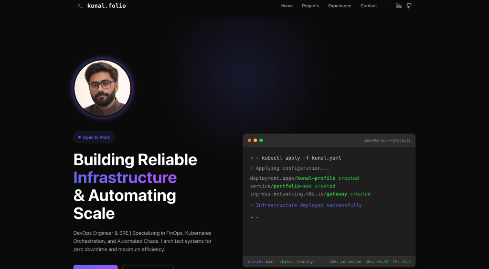

# DevOps Portfolio - Kunal

A professional, high-performance portfolio website designed for DevOps Engineers and Site Reliability Engineers (SREs). This project highlights expertise in cloud infrastructure, automation, and system reliability through a modern, terminal-themed interface.




## ✨ Key Features

- **Terminal-Themed Hero Section**: A unique, developer-centric introduction with dynamic typing animations simulating CLI operations.
- **Modern & Responsive Design**: Built with a mobile-first approach using CSS Grid, Flexbox, and Glassmorphism effects.
- **Performance Optimized**: Powered by [Vite](https://vitejs.dev/) for instant server starts and lightning-fast HMR (Hot Module Replacement).
- **Type-Safe Code**: Fully written in [TypeScript](https://www.typescriptlang.org/) for robust and maintainable code quality.
- **Interactive Elements**: Smooth hover effects, gradient text, and seamless navigation.

## 🛠️ Technology Stack

- **Frontend**: React 18
- **Language**: TypeScript
- **Build Tool**: Vite
- **Styling**: Native CSS Variables (Dark Mode native)
- **Icons**: Lucide React

## 🚀 Getting Started

Follow these instructions to set up the project on your local machine for development and testing purposes.

### Prerequisites

Ensure you have the following installed on your system:
- **Node.js**: v18.0.0 or higher ([Download](https://nodejs.org/))
- **npm**: v9.0.0 or higher (Usually bundled with Node.js)
- **Git**: ([Download](https://git-scm.com/))

### Installation

1. **Clone the repository**
   ```bash
   git clone <repository-url>
   cd kunal_portfolio
   ```

2. **Install dependencies**
   Run the following command to install all required packages:
   ```bash
   npm install
   ```

3. **Start the development server**
   ```bash
   npm run dev
   ```
   Open [http://localhost:5173](http://localhost:5173) to view the application in your browser.

## 📦 Building for Production

To create a production-ready build:

```bash
npm run build
```

The build artifacts will be generated in the `dist/` directory. You can preview the production build locally using:

```bash
npm run preview
```

## 🔧 Customization

You can easily update the content to match your profile:

- **Personal Info**: Update `src/components/Hero.tsx` and `About.tsx` to change the bio and headline.
- **Experience**: Edit the `experiences` array in `src/components/Experience.tsx`.
- **Projects**: Modify the `projects` array in `src/components/Projects.tsx`.
- **Skills**: Adjust the `skillCategories` in `src/components/Skills.tsx`.
- **Contact Details**: Update email and location in `src/components/Contact.tsx`.

## 📄 License

This project is licensed under the MIT License - see the [LICENSE](LICENSE) file for details.

---

**Author**: Kunal
**Role**: DevOps Engineer | SRE
**Contact**: kunalsingh2703@gmail.com
